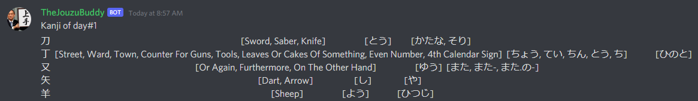
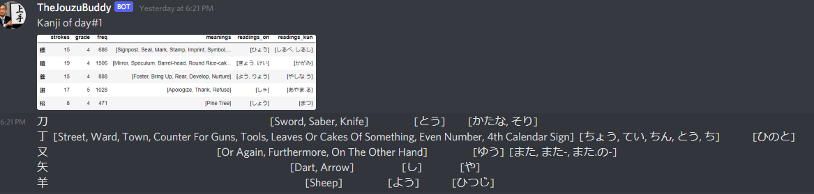

# JLPT Kanji Discord Bot - 0.1.0
> A bot that sends a daily amount of JLPT N1-5 (default is N1) Level Kanji.

## Setup

### Discord:
1. Obtain the discord bot token by creating a discord bot - [(easy to follow tutorial)](https://www.freecodecamp.org/news/create-a-discord-bot-with-python/).
2.  Find the channel id by copying any message sent in the channel; the link will follow this pattern: https://discord.com/channels/server_id/==channel_id==/message_id
	e.g. https://discord.com/channels/7622263111111128/==7683414443731611111==/82223705605411111
### Heroku:
3. Create a Heroku app.
4. Setup the environment variables (discord bot token and the channel id) on the Heroku app settings.

### GitHub:
5. Fork the current repository.
6. Deploy it on Heroku by pushing.

 ### Notes:
 - Make sure the worker is enabled on the resources tab on Heroku.
 - Alternatively you can run it on your machine or another server and uncomment the generated-picture code to get image + text.
  doesn't work with Heroku due to an error when deploying with dataframe_images library.

## Usage
There's no commands, it's a scheduled job that activates every 24 hours, just deploy it to Heroku.

## Disclaimers
The JLPT Kanji datasets is provided by [kanji-data](https://github.com/davidluzgouveia/kanji-data).
